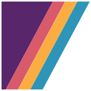

<a id="readme-top"></a>
# It Gets Better

Custome theme for `itgetsbetter.org`

---


<!-- PROJECT SHIELDS -->
<!--
*** I'm using markdown "reference style" links for readability.
*** Reference links are enclosed in brackets [ ] instead of parentheses ( ).
*** See the bottom of this document for the declaration of the reference variables
*** for contributors-url, forks-url, etc. This is an optional, concise syntax you may use.
*** https://www.markdownguide.org/basic-syntax/#reference-style-links
-->
[![Contributors][contributors-shield]][contributors-url]
[![Forks][forks-shield]][forks-url]
[![Stargazers][stars-shield]][stars-url]
[![Issues][issues-shield]][issues-url]
[![GNU General Public License][license-shield]][license-url]


<!-- PROJECT LOGO -->
<br />
<div align="center">
  <a href="https://github.com/igbetter/igb">
    
  </a>

<h3 align="center">It Gets Better theme (2024)</h3>

  <p align="center">
	<a href="https://github.com/igbetter/igb/issues/new?labels=bug&template=bug-report---.md">🐞 <b>Report a Bug</b> 🐞</a>
  </p>
</div>


<!-- TABLE OF CONTENTS -->
<details>
  <summary>Table of Contents</summary>
  <ol>
    <li>
      <a href="#about-the-project">About The Project</a>
      <ul>
        <li><a href="#built-with">Built With</a></li>
      </ul>
    </li>
    <li>
      <a href="#getting-started">Getting Started</a>
      <ul>
        <li><a href="#prerequisites">Prerequisites</a></li>
        <li><a href="#installation">Installation</a></li>
		<li><a href="#development">Development</a></li>
      </ul>
    </li>
    <li><a href="#task-runner-details">Task Runner Details</a></li>
    <li><a href="#scss">SCSS</a></li>
	<ul>
        <li><a href="#structure">Structure</a></li>
        <li><a href="#theming">Theming</a></li>
		<li><a href="#responsive-mixins">Responsive Mixins</a></li>
		<li><a href="#other-notes">Other Notes</a></li>
      </ul>
    <li><a href="#roadmap">Roadmap</a></li>
    <li><a href="#contact">Contact</a></li>
  </ol>
</details>


<!-- ABOUT THE PROJECT -->
## About The Project

[![Product Name Screen Shot][product-screenshot]](https://example.com)

Welcome to the new new website codebase. (launched in 2024)

This repo starts at the `www` root directory--as per instructions by the  [Pressable documentation](https://pressable.com/knowledgebase/how-deploy-to-your-sites-using-git/)


<p align="right">(<a href="#readme-top">back to top</a>)</p>


### Built With

* WordPress
* Node.js
* Gulp
* ACF pro
* 💜 love

<p align="right">(<a href="#readme-top">back to top</a>)</p>


<!-- GETTING STARTED -->
## Getting Started


### Prerequisites

* Insure that you have [node.js](https://nodejs.org) installed.
	 
  ```sh
  npm install npm@latest -g
  ```
* Ensure that at least the following plugins are **installed and active** on your local environment:
	* ACF Pro
	* FacetWP
	* Formidable Forms Pro
* All plugins used can be found in the [`igb-plugins`](https://github.com/igbetter/igb-plugins) repo

### Installation


1. Clone the repo into your root WP folder
   ```sh
   git clone https://github.com/igbetter/igb.git
   ```
2. Install NPM packages
   ```sh
   npm install
   ```

### Development

1. Navigate to the root of the `it-gets-better` theme
	```sh
	cd wp-content/themes/it-gets-better
	```
2. Change line 75 in `gulpfile.js` to your localhost url
	```js
	proxy: "CHANGETHIS.local"
	```
3. Start gulp
	```sh
	gulp watch
	```
	(or simply `gulp` to run tasks once and not activate the watch and browsersync)
	
4. Go forth and write beautiful code!

<p align="right">(<a href="#readme-top">back to top</a>)</p>


<!-- TASK RUNNER -->
## Task Runner Details

There are a few processes that happen on `gulp` and `gulp watch`:
* All SCSS files in `_assets/scss` (and inclosing folders) are processed and combined into the `_assets/css/` directory
* All `.js` files in `_assets/js/src_scripts` are combined and minimized into `_assets/js/scripts.js`
* All original SVG files added into `_assets/svg/originals` are added to the SVG sprite found in `_assets/svg/output`
	* View `sprite.symbol.html` for information on useage

<p align="right">(<a href="#readme-top">back to top</a>)</p>


<!-- SCSS -->
## SCSS

### Structure
```
📄 _variables.scss		// SCSS variables & theming 
📄 editor-styles.scss	// all imports for editor-style.css
📄 styles.scss			// all imports for style.css
📁 base
	📄 _base 			// @import for folder
	📄 _font_import
	📄 _general
	📄 _icons
	📄 _layout
	📄 _utilities		// @mixin (theming & responsive) & @keyframes
📁 blocks
	📄 _blocks			// @import for folder
	📄 _core_block_style_fixes
	📄 _featured-content
	📄 _hero
	📄 _more_content
	📄 _page-link
	📄 _term-list
📁 components
	📄 _a11y_slider
	📄 _accordion_tabs
	📄 _components		// @import for folder
	📄 _dividers
	📄 _footer
	📄 _forms
	📄 _header
	📄 _loop
	📄 _media
	📄 _modal
	📄 _nav
	📄 _newsletter_signup
	📄 _related_asides
	📄 _search_bar
	📄 _search_overlay
	📄 _term_tags
📁 pages
	📄 _archive
	📄 _browse_and_search
	📄 _eduguides
	📄 _glossary
	📄 _home
	📄 _pages			// @import for folder
	📄 _playlist
	📄 _singular

```

### Theming

Almost any time you define color in the styles, you will need to use the built in theming function. This has two parts:
1. in the `_variables.scss` file, you will either locate or create a theme variable. 
2. in the SCSS file, you will include this variable within the `themify` @include

#### 1. Theme variable

The theme variables are all added to the `$themes` varable twice, once for **<mark> light </mark>** and once for **<mark> dark </mark>**. If you are creating a new variable, don't forget to add both.

The structure looks like this:
```scss
$themes:(
	light: (
		theThemeVariableName: $the_light_mode_value,
		.
		.
		.
	),
	dark: (
		theThemeVariableName: $the_dark_mode_value,
		.
		.
		.
	),
)
```
For this example, the theme variable is `theThemeVariableName`

#### 2. SCSS usage

Then in the SCSS file, you will connect this variable in the following way:

```scss
.example-thing {
	display: block;
	padding: 2em;
	
	@include themify($themes) {
		color: themed('theThemeVariableName');
		background: themed('backgroundColor');
	}
}
```

### Responsive Mixins

This theme also has an easy mixin for responsive styles. This mixin is flexible and can be added within a style declaration block, or outside of it.

Usage of the responsive mixins are as follows:

```scss
// inside a declaration block
.thing-im-styling {
	width: 50%;
	
	@include phone-only {
		width: 90%
	}
}

// outside the declaration
@include tablet-up {
	.thing-im-styling {
		width: 50%;
	}
	.only-show-on-mobile {
		display: none;
	}
}

```

The responsive options available are:

| Option | Value |
|----|----|
| phone-only | `max-width: 600px` |
| tablet-only | `min-width: 600px` and `max-width: 1200px` |
| tablet-portrait | `min-width: 600px` and `max-width: 900px` and `orientation: portrait` |
| tablet-landscape | `min-width: 900px` and `max-width: 1200px` and `orientation: landscape` |
| desktop | `min-width: 1200px` |
| large-desktop | `min-width: 1800px` |
| tablet-down | `max-width: 900px` |
| tablet-up | `min-width: 900px` |
| phone-up | `min-width: 600px` |
| phone-landscape | `min-width: 600px` and `max-width: 900px` and `orientation: landscape` |
| portrait | `orientation: portrait` |
| short-screen | `max-height: 625px` |


### Other Notes


<p align="right">(<a href="#readme-top">back to top</a>)</p>


<!-- ROADMAP -->
## Roadmap
- [x] Update README
- [x] New main nav
- [x] Mutilingual EduGuide Buttons
    - [x] Custom Block for EduGuide card
- [ ] New hero

See the [open issues](https://github.com/igbetter/igb/issues) for a full list of proposed features (and known issues).


<p align="right">(<a href="#readme-top">back to top</a>)</p>


<!-- CONTACT -->
## Contact


Project Link: [https://github.com/igbetter/igb](https://github.com/igbetter/igb)

<p align="right">(<a href="#readme-top">back to top</a>)</p>


<!-- MARKDOWN LINKS & IMAGES -->
<!-- https://www.markdownguide.org/basic-syntax/#reference-style-links -->
[contributors-shield]: https://img.shields.io/github/contributors/igbetter/igb.svg?style=for-the-badge
[contributors-url]: https://github.com/igbetter/igb/graphs/contributors
[forks-shield]: https://img.shields.io/github/forks/igbetter/igb.svg?style=for-the-badge
[forks-url]: https://github.com/igbetter/igb/network/members
[stars-shield]: https://img.shields.io/github/stars/igbetter/igb.svg?style=for-the-badge
[stars-url]: https://github.com/igbetter/igb/stargazers
[issues-shield]: https://img.shields.io/github/issues/igbetter/igb.svg?style=for-the-badge
[issues-url]: https://github.com/igbetter/igb/issues
[license-shield]: https://img.shields.io/github/license/igbetter/igb.svg?style=for-the-badge
[license-url]: https://github.com/igbetter/igb/blob/main/wp-content/themes/it-gets-better/LICENSE
[product-screenshot]: wp-content/themes/it-gets-better/screenshot.png
